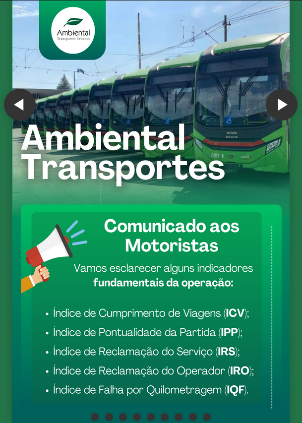

# Índices Ambiental Transportes Urbanos
This project presents various environmental indices for urban transportation. 
The indices are displayed in a "column" style, similar to Instagram, allowing employees to scroll through the images vertically. Each image is placed within a container that provides spacing and shadow effects to enhance visibility and aesthetics.



## Live Demo

The project is online and can be accessed through [this link over here](https://flyer-flip.vercel.app/). Visit this link to see how the project looks and functions.

## Project Structure
The project is structured as follows:

- HTML: The main structure of the webpage.
- CSS: Styling for the webpage to enhance appearance and layout.

### HTML
The HTML file sets up the structure of the webpage. It includes:

- A main container (container-main) that holds all image containers.
- Each image is placed within a container-images div.
- Images are displayed in a vertical column, providing a seamless scrolling experience.

### CSS
The CSS file is responsible for the styling of the webpage:

- The background color of the body is set to a specific green shade.
- Each image container (container-images) has a black border, specific height and width, and centered alignment.
- Shadow effects are applied to the images to make them stand out.
- Margins are used to provide space between image containers.

## How to Run
First, clone the repository:
```sh
git clone https://github.com/yourusername/environmental-urban-transport-indices.git
```
Open ``index.html`` in your browser to view the webpage.

### Project Features

- ``Scrolling Column Layout``: Images are displayed in a vertical column layout similar to Instagram.
- ``Image Containers:`` Each image is enclosed in a container with spacing and shadow effects.
- ``Responsive Design:`` The design is responsive and adapts to different screen sizes.